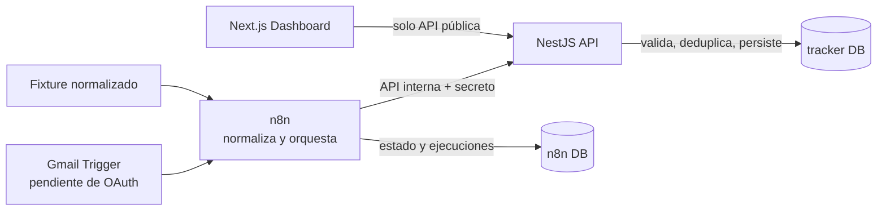

# Nexo · Personal Tracker

Base ejecutable de una aplicación de seguimiento financiero personal preparada para evolucionar a un producto multiusuario. PostgreSQL es la fuente oficial; NestJS valida y persiste; n8n orquesta; Next.js consume exclusivamente la API.

Gmail **no está conectado ni validado**. El workflow queda importado, inactivo y esperando una credencial OAuth2 real.

## Requisitos

- Docker Desktop 4.40+ o Docker Engine 27+ con Compose v2.
- 6 GB de RAM libres recomendados durante la primera construcción.
- Node.js 24.15+ y pnpm 11.19.0 solo para desarrollo fuera de Docker.
- Puertos locales libres: `3000`, `3001` y `5678`.

Versiones fijadas: Node 24.19.0, Next 16.3.4, React 19.2.8, NestJS 12.0.1, Prisma 7.10.0, PostgreSQL 18.6 y n8n 2.37.4. La selección está registrada en `packages/config/versions.json` y el razonamiento en `docs/decisions/004-runtime-versions.md`.

## Arquitectura



Los límites completos están en `docs/architecture.md`.

## Desarrollo coordinado

Las tareas futuras y los subagentes deben comenzar leyendo `AGENTS.md` y `docs/project-memory.md`. La propiedad de dominios, el protocolo para trabajo paralelo y el flujo independiente de Hábitos están definidos en `docs/workstreams.md`.

## Inicio rápido

1. Copia `.env.example` a `.env`.
2. Cambia todas las variables que contienen `change-me`; usa valores aleatorios de al menos 32 caracteres para claves y secretos.
3. Ejecuta:

```text
docker compose up --build -d
```

4. Espera a que los servicios estén saludables:

```text
docker compose ps -a
```

`postgres`, `api`, `web` y `n8n` deben mostrar `healthy`. `migrate` y `n8n-import` deben mostrar `Exited (0)` porque son trabajos de una sola ejecución.

## Servicios y URLs locales

| Servicio   | URL                                   | Propósito            |
| ---------- | ------------------------------------- | -------------------- |
| Dashboard  | http://localhost:3000                 | Interfaz financiera  |
| API        | http://localhost:3001                 | API pública local    |
| Swagger    | http://localhost:3001/docs            | Contrato OpenAPI     |
| API health | http://localhost:3001/health/database | API → PostgreSQL     |
| n8n        | http://localhost:5678                 | Editor y ejecuciones |

En el primer acceso a n8n, crea el propietario local mediante su pantalla inicial. Los ocho workflows ya están en la base `n8n`. Esta cuenta se guarda únicamente en el volumen local de n8n.

PostgreSQL no publica un puerto al host. Para administrarlo usa `docker compose exec postgres psql ...` o configura temporalmente un binding solo en un override local.

## Comandos de desarrollo

```text
pnpm install
pnpm lint
pnpm typecheck
pnpm build
pnpm workflows:validate
docker compose config --quiet
```

Prisma:

```text
pnpm db:generate
pnpm db:migrate
pnpm db:seed
```

El seed solo se ejecuta si `LOCAL_AUTH_ENABLED=true`. Crea un tenant, usuario y membresía determinísticos, además de una integración Gmail en `pending`; nunca crea cuentas, categorías ni transacciones.

## Workflows de n8n

La importación ocurre automáticamente mediante `n8n-import`. Para restaurarlos manualmente:

```text
docker compose run --rm n8n-import
```

Valida los archivos exportados:

```text
pnpm workflows:validate
```

Ejecuta la prueba real n8n → API → PostgreSQL:

```text
pnpm workflows:connectivity
```

El script detiene n8n brevemente para evitar que dos procesos usen el mismo task broker, ejecuta `98 - System - Connectivity Check` desde la base importada y vuelve a iniciar n8n.

## Gmail

`00 - Gmail - Ingestion` está **inactivo** y contiene el placeholder `GMAIL_OAUTH_CREDENTIAL_REQUIRED`. Consulta `docs/gmail-setup.md` para crear la credencial, seleccionarla y activar el workflow conscientemente. No se incluyeron tokens, client secrets ni credenciales ficticias.

## Operación local

Detener sin borrar datos:

```text
docker compose stop
```

Volver a iniciar conservando bases y configuración:

```text
docker compose start
```

Recrear contenedores conservando volúmenes:

```text
docker compose down
docker compose up --build -d
```

Eliminar **todos los datos locales de este proyecto** de forma explícita:

```text
docker compose down --volumes
```

Ese último comando elimina los volúmenes con nombre `tracker_*`, incluidas ambas bases, el propietario de n8n y sus configuraciones. Haz primero el backup descrito en `docs/backup-restore.md`.

## Perfiles opcionales

- `scale`: Redis y un worker n8n. Antes de usarlo establece `EXECUTIONS_MODE=queue`; luego ejecuta `docker compose --profile scale up -d`.
- `production`: Caddy con HTTPS. Configura un dominio real, DNS y correo ACME; después ejecuta `docker compose --profile production up -d`.

No se declara un perfil de observabilidad porque esta fase no implementa una pila real de métricas.

## Solución de problemas

- **Docker no responde:** inicia Docker Desktop y espera a que `docker info` muestre el servidor.
- **Un servicio no está healthy:** ejecuta `docker compose logs --tail 200 <servicio>`.
- **`migrate` falla:** confirma que `postgres` está healthy y que las contraseñas de `.env` no cambiaron después de crear el volumen. Si cambiaron, restáuralas o recrea únicamente los datos locales después de un backup.
- **El dashboard muestra error:** verifica `http://localhost:3001/health/database` y que `LOCAL_TENANT_ID` sea igual en API y web.
- **n8n no muestra workflows:** ejecuta `docker compose run --rm n8n-import`; confirma `Exited (0)` en sus logs.
- **Gmail no puede activarse:** es el estado esperado hasta completar OAuth2 y seleccionar la credencial en el nodo Gmail Trigger.
- **Windows/OneDrive:** evita pausar la sincronización durante builds y no abras simultáneamente el repositorio desde WSL y Windows.

## Documentación

- `docs/architecture.md`: componentes, multi-tenancy, idempotencia, flujo de errores y fronteras futuras.
- `docs/database.md`: modelo, constraints, índices, cascadas y RLS futuro.
- `docs/n8n.md`: workflows, importación, ejecución y auditoría.
- `docs/gmail-setup.md`: configuración OAuth pendiente.
- `docs/deployment.md`: despliegue inicial en servidor.
- `docs/backup-restore.md`: backup y restauración.
- `docs/security.md`: controles y pendientes antes de comercializar.

## Alcance no implementado

No se procesaron correos reales, no existe adapter bancario, no se activó Gmail OAuth, no hay detección automática de recurrentes, autenticación comercial, Garmin, MCP, Gmail add-on ni despliegue público. Estas ausencias son deliberadas y no se presentan como funciones terminadas.
