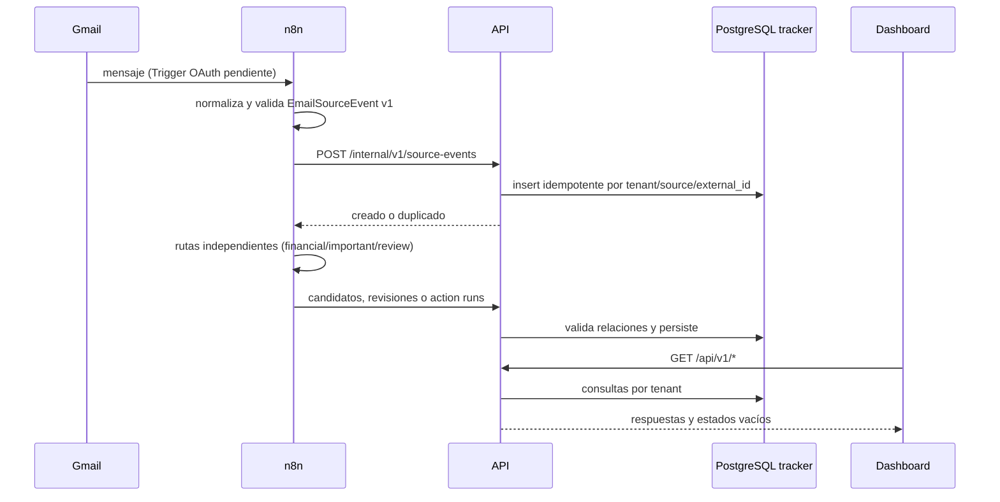

# Arquitectura

## Estilo y límites

El sistema es un monolito modular desplegado como dos procesos de aplicación: Next.js para presentación y NestJS para dominio. No hay microservicios. Los módulos `core`, `finance`, `automation` e `integrations` comparten una transacción y una base `tracker`, pero conservan controllers, servicios, contratos y schemas separados.

- **Dashboard:** renderiza datos y estados; nunca conoce credenciales de servicio, PostgreSQL ni el API interno de n8n.
- **API:** única puerta de entrada al dominio; valida tenant, contratos, idempotencia y relaciones.
- **n8n:** conecta proveedores y coordina pasos; no es fuente oficial ni API pública.
- **PostgreSQL:** mantiene `tracker` y `n8n` en bases distintas, con roles propietarios separados.
- **Contracts:** esquemas Zod y tipos TypeScript versionados. La API usa exactamente estos esquemas; los Code nodes aplican las mismas invariantes de borde antes de llamar a la API.

## Flujo de correo



## EmailConnector

La frontera conceptual es:

```text
EmailConnector.pullOrReceive() -> EmailSourceEvent v1
```

Gmail Trigger, Gmail API + Pub/Sub, correo reenviado y fixtures deben terminar en el mismo contrato. Ningún adapter bancario recibe un objeto específico del nodo Gmail.

La evolución a Gmail API + Pub/Sub reemplazará solo el conector de entrada: un receptor verificará notificaciones, recuperará el mensaje con scopes mínimos, normalizará y llamará al mismo endpoint idempotente. El historial de Gmail no se usará como base del dashboard.

Un Gmail add-on futuro puede enviar manualmente el mensaje seleccionado a esta API normalizada. El reenvío de correo será otro `EmailConnector`. Un MCP futuro se construirá sobre endpoints autenticados de la aplicación; nunca consultará tablas internas de n8n.

## Multiusuario

Toda tabla de dominio incluye `tenant_id` directa o queda encadenada a un `source_event` con tenant. La API resuelve el tenant antes de consultar. El header local y `LOCAL_TENANT_ID` existen solo cuando `LOCAL_AUTH_ENABLED=true`; no son autenticación de producción.

La fase comercial debe añadir proveedor de identidad, sesiones, autorización de membresías y RLS. La política propuesta es establecer `SET LOCAL app.tenant_id` por transacción y políticas que comparen `tenant_id` con `current_setting('app.tenant_id')::uuid`.

## Idempotencia

- Source events: unique `(tenant_id, source, external_id)` y SHA-256 del payload. Misma clave + mismo hash devuelve `duplicate=true`; otro hash produce `409 IDEMPOTENCY_CONFLICT`.
- Transactions: índices únicos parciales diferencian candidatos con y sin `external_reference`.
- Review queue: unique `(tenant_id, source_event_id)`.
- Action runs: `idempotency_key` global única.
- n8n usa `eventId` como correlation ID y conserva IDs estables de workflow.

## Errores y observabilidad mínima

La API genera JSON de error con código, mensaje sanitizado, status y correlation ID. Pino escribe logs JSON, redacta autorización, cookies y secreto interno y no registra cuerpos. `99 - Error Handler` reduce los fallos de n8n a metadatos sanitizados y usa `action_runs` cuando la API está alcanzable.

Los cuerpos de correo se guardan en `source_events.payload` porque el modelo de esta fase los exige para reproceso. Antes de producción debe existir un job de retención que elimine o redacte `textBody/htmlBody` después del período aprobado, conservando hash y metadatos mínimos.

## Escalamiento

Primero se escala verticalmente el monolito. El perfil `scale` añade Redis y workers n8n. La API puede replicarse detrás del proxy porque no guarda sesión en memoria; antes de múltiples réplicas web se debe coordinar la caché de Next.js si se habilita cache persistente.
